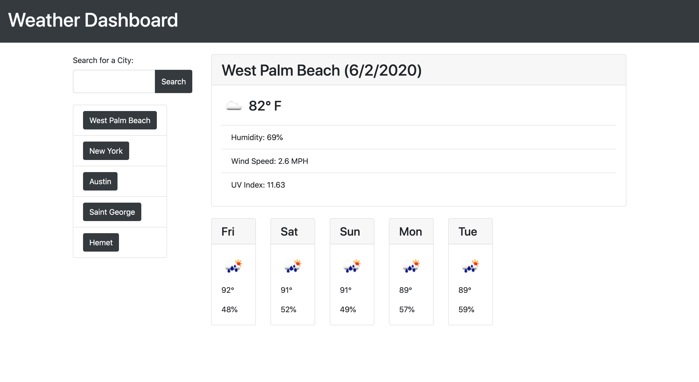

# weather_dashboard
A user-friendly weather dashboard utilizing the OpenWeather API to display weather information based on user input.
The dashboard will display current conditions and five day forecast for a given city.
It will also store up to five of the user's most recent searches as clickable buttons.

[Link](https://mjgross82.github.io/weather_dashboard/)
